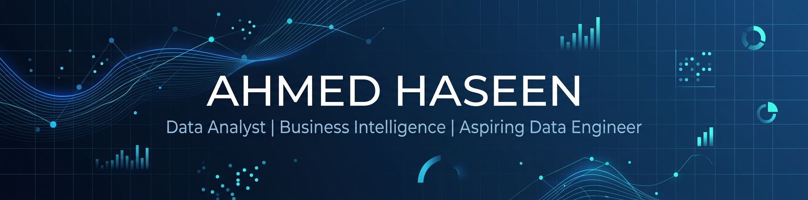

<!-- ═══════════════════════════════════════════════════════════════════════════ -->
<!-- 🎯  AHMED HASEEN — GitHub Profile README                                  -->
<!-- ═══════════════════════════════════════════════════════════════════════════ -->

<!-- BANNER -->
<div align="center">
  
</div>

<!-- TYPING ANIMATION -->
<div align="center">
  <a href="https://git.io/typing-svg">
    
  </a>
</div>

<!-- SOCIAL BADGES -->
<div align="center">
  
  [](https://linkedin.com/in/ahmed-haseen)
  [](https://ahmed-haseen-portfolio.netlify.app/)
  [](mailto:mh.ahmedhaseen.ai@gmail.com)
  [](https://github.com/AhmedHaseen)
  
</div>

<br/>

<!-- ABOUT ME -->
##  &nbsp;About Me

<table>
<tr>
<td>

🎓 &nbsp;Software Engineering undergraduate at **Sabaragamuwa University of Sri Lanka** (GPA: 3.65/4.00)

🏢 &nbsp;Currently an **Intern Data Analyst** at **MAS Holdings** — MAS Intimates, Vidiyal Plant

📊 &nbsp;Passionate about **Data Analytics**, **Business Intelligence**, and **Data Engineering**

🔧 &nbsp;Hands-on experience with **SQL**, **Power BI**, **Excel**, and **Python** through end-to-end analytics projects

🏭 &nbsp;Gaining industry exposure to **SAP-based data handling**, warehouse operations, reporting & data-driven decision-making

🔄 &nbsp;Developing skills in **data transformation**, **databases**, **data pipelines** & **data integration**

🎯 &nbsp;Goal: Build strong capabilities across both **analytics & engineering** to create reliable, data-driven solutions

🥋 &nbsp;Karate **Black Belt 2nd Dan** (Nidan) | 🥉 Taekwondo **Bronze Medalist** — Inter-University Games 2025

</td>
</tr>
</table>

<details>
<summary><b>⚡ Quick Glance</b></summary>
<br/>

```yaml
📍 Location:      Sri Lanka
🎓 University:    Sabaragamuwa University of Sri Lanka
📚 Degree:        BSc (Hons) in Software Engineering (2023–2027)
📊 GPA:           3.65 / 4.00
🏢 Current Role:  Intern Data Analyst @ MAS Holdings
🔭 Exploring:     Data Engineering, ETL Pipelines, Azure
🌱 Learning:      Predictive Analytics, Advanced DAX, Machine Learning
```

</details>

<!-- CURRENT ROLE -->
## 🏢 Currently Working At

<div align="center">

<table>
  <tr>
    <td align="center" width="100%">
      <h3>🏭 MAS Holdings</h3>
      <p><strong>Intern Data Analyst</strong></p>
      <p>MAS Intimates — Vidiyal Plant | Finished Good Warehouse Department</p>
      <p>
        
        
        
      </p>
      <p><em>Working on data analytics, SAP-based data handling, warehouse reporting, and business intelligence in a manufacturing environment.</em></p>
    </td>
  </tr>
</table>

</div>

<br/>

<!-- TECH STACK -->
## 🛠️ Tech Stack & Tools

<div align="center">

### 💻 Languages


### 📊 Data Analytics & Visualization


### 🐍 Python Libraries


### 🗄️ Databases


### ⚙️ Tools & Platforms


</div>

<br/>

<!-- GITHUB STREAK -->
## 🔥 GitHub Streak

<div align="center">
  <picture>
    <source media="(prefers-color-scheme: dark)" srcset="https://streak-stats.demolab.com?user=AhmedHaseen&theme=tokyonight&hide_border=true&background=0D1117&stroke=64FFDA&ring=64FFDA&fire=FF6B6B&currStreakLabel=64FFDA&sideLabels=C9D1D9&currStreakNum=C9D1D9&sideNums=C9D1D9&dates=8B949E" />
    
  </picture>
</div>

<br/>

<!-- TROPHIES -->
## 🏆 GitHub Trophies

<div align="center">
  
</div>

<br/>

<!-- FEATURED PROJECTS -->
## 📂 Featured Projects

<div align="center">

| # | Project | Tech Stack | Description |
|:---:|:---|:---|:---|
| 📡 | [**Telecom Customer Churn Analytics & Prediction**](https://github.com/AhmedHaseen/telecom-customer-churn-analytics-prediction) | `SQL Server` `Power BI` `Python` `Scikit-Learn` | ETL pipeline for 6K+ records, churn dashboards & Random Forest model (84% accuracy) |
| 🍔 | [**Swiggy Sales Data Analysis**](https://github.com/AhmedHaseen/swiggy-sales-data-analysis-python) | `Python` `Pandas` `Matplotlib` `Seaborn` `Plotly` | Analyzed 197K+ food delivery records with KPI calculations & visualizations |
| 📊 | [**Data Careers Dashboard**](https://github.com/AhmedHaseen/data-careers-powerbi-dashboard) | `Power BI` `Power Query` `DAX` | Interactive dashboard analyzing 630+ data professionals' survey responses |
| 🗄️ | [**Global Layoffs EDA**](https://github.com/AhmedHaseen/mysql-portfolio-project) | `MySQL` | Workforce reduction trends analysis using CTEs, window & ranking functions |
| 🚲 | [**Bike Sales Analysis Dashboard**](https://github.com/AhmedHaseen/Excel-Bike-Sales-Analysis) | `Microsoft Excel` | Interactive dashboard with Pivot Tables, Charts & Slicers |
| 🤖 | [**ConfidFace — AI Mock Interview Platform**](https://github.com/AhmedHaseen/ConfidFace-Web-App) | `Next.js` `Gemini AI` `D-ID` `n8n` `Clerk` | AI-powered interview simulator with avatar interviewer, voice capture & automated feedback |

</div>

<br/>

<!-- CERTIFICATIONS -->
## 🏅 Certifications

<div align="center">

| 🎓 Certificate | 🏛️ Issued By | 📚 Key Skills |
|:---|:---|:---|
| What is Data Science? | **IBM** (Coursera) | Data Science Lifecycle, EDA, Statistical Thinking |
| Fast-Track Data Analysis | **Google** (Coursera) | AI-Assisted Analysis, Spreadsheet Automation |
| Speed Up Data Analysis | **Google** (Coursera) | Generative AI Workflows, Analytics Productivity |
| Marketing Analytics | **Coursera** | Predictive Analysis, KPI Dashboards |

</div>

<br/>

<!-- ACHIEVEMENTS -->
## 🏆 Achievements & Fun Facts

<div align="center">

| 🏅 Achievement | 📝 Details |
|:---|:---|
| 🥉 **Bronze Medalist — Taekwondo** | SLUG Inter-University Games 2025, representing Sabaragamuwa University |
| 🥋 **Black Belt 2nd Dan (Nidan)** | Certified by Sri Lanka Karate Federation (SLKF) |
| 📊 **5+ End-to-End Analytics Projects** | From ETL pipelines to interactive dashboards |
| 🎓 **GPA: 3.65 / 4.00** | BSc Software Engineering — Sabaragamuwa University |

</div>

<br/>


<!-- CONTRIBUTION SNAKE -->
<!-- Uncomment below after setting up the GitHub Action (instructions in the setup guide) -->
<!--
<div align="center">
  
</div>
-->

<!-- CONNECT -->
## 🤝 Let's Connect!

<div align="center">
  
  <p>
    <i>I'm always open to collaborating on data analytics projects, learning opportunities, and interesting conversations!</i>
  </p>

  [](https://linkedin.com/in/ahmed-haseen)
  [](mailto:mh.ahmedhaseen.ai@gmail.com)
  [](https://ahmed-haseen-portfolio.netlify.app/)

</div>

<br/>

<!-- FOOTER -->
<div align="center">
  
</div>

<!-- ═══════════════════════════════════════════════════════════════════════════ -->
<!-- 💡  Built with ❤️ by Ahmed Haseen                                         -->
<!-- ═══════════════════════════════════════════════════════════════════════════ -->
